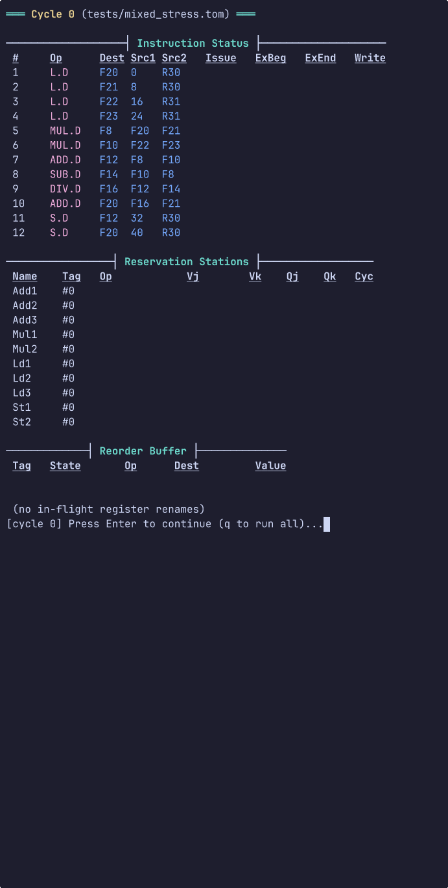

<!--
    SPDX-License-Identifier: ISC
    SPDX-FileCopyrightText: Copyright © 2026 Lucca M. A. Pellegrini <lucca@verticordia.com>
-->

# Tomasulo's Algorithm Simulator

A small and self-contained [Tomasulo's
Algorithm](https://doi.org/10.1147%2Frd.111.0025) Simulator, implementing
classic [out-of-order
execution](https://people.engr.tamu.edu/djimenez/taco/utsa-www/cs5513-fall07/lecture5.html)
with [register renaming](https://fp32.org/register_renaming.html) via
reservation stations and a common data bus (CDB), submitted for the course
“Arquitetura de Computadores III” ([Instituto de Ciências Exatas e
Informática](https://icei.pucminas.br/), Pontifícia Universidade Católica de
Minas Gerais), 2026/1, Prof. Matheus Alcântara Souza.

## Overview

The simulator implements *Tomasulo's Algorithm*, a hardware algorithm for
dynamic instruction scheduling that enables out-of-order execution. It attempts
to accurately model reservation stations and load/store buffers, register
renaming, a reorder buffer, a common data bus, structural hazards, and data
hazards. The simulator itself, as well as the program's entry point and
visualization logic, are written entirely in
[C23](https://en.cppreference.com/c/23); the parser for its [custom
configuration format](tests/) is written with the
[Flex](https://github.com/westes/flex) lexer generator and the [GNU
Bison](https://www.gnu.org/software/bison/) parser generator; and a number of
*(optional)* unit tests are written in [Zig
v0.16.0](https://ziglang.org/documentation/0.16.0/). It is compiled with
[Clang](https://clang.llvm.org/) and targets Linux with
[musl](http://musl.libc.org/) by default, but a [Dockerfile](Dockerfile)
and a [docker-compose.yml](docker-compose.yml) are provided to allow running
wherever [Docker](https://www.docker.com/) or [Podman](https://podman.io/)
are supported.

### The Algorithm

Instructions that have been loaded to the instruction queue are executed [in
four stages](http://thebeardsage.com/tomasulos-algorithm-instruction-lifecycle/):
***(I)*** If there's a corresponding reservation station (RS) available and a
free space in the reorder buffer (ROB), the instruction is *issued*: we send
the operands to the reservation station if they are available in either the
registers or the ROB; otherwise, we stall (the number of the ROB entry
allocated for the result is also sent to the RS, so that it can be used to
*tag* the result when it's broadcast on the common data bus). ***(II)*** If one
or more operands are not available, we monitor the common data bus (CDB) as we
wait for it to be computed (this checks for read-after-write hazards): when
both operands are available at a reservation station, we *execute* the
operation. ***(III)*** When the result is available, we *write it back* on the
CDB, with the tag that was sent when the instruction was issued, and from the
CDB into the ROB, and to any other RSs that were waiting for the result.
***(IV)*** Finally, the result of the operation is *committed*: if an
arithmetic or load operation finishes, the result is committed back to the
register file; if a store operation finishes, the result is committed to the
effective memory address specified by the operands.

### Demo

[](https://asciinema.org/a/xdZA1AMgq1HxeWEd)

### Implementation

Each *Reservation Station (RS)* holds two fields for the values of its operands
(\( V_j, V_k \)) and two additional fields for the tags of their producers
(\( Q_j, Q_k \)). If an operand is not yet available, the corresponding \( Q \)
field holds the ROB tag of the instruction that will produce it; otherwise it
is zero and the value can be used directly from \( V \). These fields are
managed through the *Register Alias Table (RAT)*, a simple array \( Q_i \) in
which each index corresponds to a floating-point register. When an instruction
that writes to a register is issued, the RAT entry for that register is updated
with the ROB tag of the new producer. This mechanism effectively performs
register renaming and eliminates Write-After-Read (WAR) and Write-After-Write
(WAW) hazards.

The simulator also maintains a *Reorder Buffer (ROB)* that tracks the state
of all in-flight instructions. Each ROB entry stores the instruction’s opcode,
destination register, computed value, and current state. Further, while a
simulation runs, the program keeps track of a number of performance metrics,
which are printed at the end. These can be used to understand how different
workloads stress a particular Tomasulo configuration.

### Configuration Format (`.tom` files)

The simulator uses a custom configuration format with the `.tom` extension.
Each test file is divided into four main sections:

- **`cycles`**: Defines the execution latency (in cycles) for each operation type.
- **`units`**: Configures the number of reservation stations or functional units available per operation type.
- **`registers`**: Initializes architectural registers (both integer and floating-point).
- **`instructions`**: Lists the instructions to be executed, in program order.

The parser is implemented using **Flex** (lexical analyzer generetor) and **GNU
Bison** (parser generator). It is a reentrant parser, which is why GNU Bison is
required (POSIX Yacc is not sufficient). The grammar and lexer definitions can
be found in [`src/parser.y`](src/parser.y) and [`src/parser.l`](src/parser.l).

To facilitate editing, this repository includes a [NeoVim](https://neovim.io/)
syntax file at
[`.config/nvim/syntax/tomasulo.vim`](.config/nvim/syntax/tomasulo.vim) and an
[`.nvimrc`](.nvimrc) file that automatically enables syntax highlighting for
`.tom` files, if the `exrc` option is set (see `:help 'exrc` for details).

#### Supported Instructions

- `ADDD Fd, Fs, Ft`: Double-precision floating-point addition
- `SUBD Fd, Fs, Ft`: Double-precision floating-point subtraction
- `MULTD Fd, Fs, Ft`: Double-precision floating-point multiplication
- `DIVD Fd, Fs, Ft`: Double-precision floating-point division
- `LD Fd, offset(Rs)`: Load double from memory
- `SD Fs, offset(Rd)`: Store double to memory

There are a total of 32 floating-point registers, `F0`–`F31`. The integer
registers, `R0`–`R31` are just syntactic sugar: the register file only stores
32 values, and only floating-point ones.

#### Example (from [`tests/wide_issue.tom`](tests/wide_issue.tom))

```tom
cycles {
    add.d = 2
    mult.d = 4 // This is a comment!
    l.d = 2
    s.d = 2 # This is also a valid comment!
}

units {
    add.d = 4
    mult.d = 4
    l.d = 4
    s.d = 2
}

registers {
    R1 = 100
    R2 = 200
    F20 = 1.0
    F21 = 2.0
    # ... more register initializations
}

instructions {
    L.D F0 0(R1)
    L.D F1 8(R1)
    MUL.D F10 F21 F22
    ADD.D F14 F20 F21
    # ...
}
```

## Building

### Requirements

- A **C23**-capable compiler (Clang 18+ or GCC 14+ recommended)
- **GNU Bison** and **Flex** (for the `.tom` parser)
- **Make** (for the traditional build)

### Using Make

```bash
make all   # Build the simulator at ./build/tomasulo
make test  # Build and run all tests in tests/
make clean # Delete build
```

### Using Zig (Recommended)

The project also includes a full **Zig** build system with hundreds of
extensive unit tests (see [src/tests/](src/tests/)). We use
**[mise-en-place](https://mise.jdx.dev/)** to manage the Zig version (0.16.0).
After cloning the repository:

```bash
mise trust   # Trust the .config/mise/config.toml file
mise install # Install Zig and other tools
mise build   # Build the simulator
mise test    # Run the full Zig test suite
```

To run the program directly:

```bash
mise exec -- zig build run # Default arguments, read from stdin
mise exec -- zig build run -- -b tests/reduction.tom # With custom arguments
```

### Using Docker & Podman

The project includes a multi-stage `Dockerfile` and `docker-compose.yml` for
easy execution anywhere Docker or Podman is available.

```bash
# Build and run a specific test
docker compose run --rm tomasulo -b tests/dot_product.tom

# Run in interactive mode
docker compose run --rm tomasulo tests/wide_issue.tom

# Enter the development environment (with all tools)
docker compose run --rm tomasulo-dev
```
